# EstudiantesNet

## 🚀 Descripción

### EstudiantesNet 
es una API REST desarrollada con .NET 8, implementada bajo principios de arquitectura limpia y buenas prácticas de desarrollo de software.

El proyecto fue utilizado como base para implementar un ecosistema DevOps que integra automatización, pruebas, seguridad, contenerización, despliegue continuo y monitoreo.

La solución incorpora:

* GitHub Actions para la automatización del proceso de integración y despliegue.
* Pruebas unitarias y cobertura de código para validar la calidad de la solución.
* Snyk para el análisis de vulnerabilidades en dependencias y en la imagen Docker.
* Docker para la contenerización de la aplicación.
* Google Artifact Registry para el almacenamiento de imágenes Docker.
* Google Cloud Run para el despliegue de la API.
* Prometheus para la recolección de métricas.
* Grafana para la visualización de métricas y configuración de alertas.
* cAdvisor para la obtención de métricas de los contenedores.

El objetivo principal es demostrar la implementación práctica de un flujo DevOps que permita integrar desarrollo, pruebas, seguridad, despliegue y monitoreo dentro de un ciclo automatizado y reproducible.

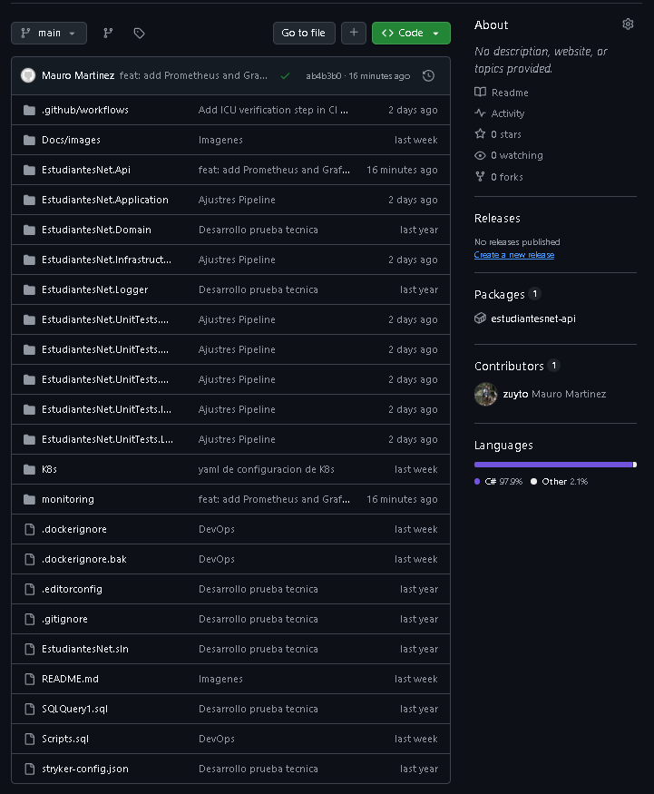


## 🏗️ Arquitectura

La solución EstudiantesNet implementa un flujo DevOps que integra desarrollo, integración continua, seguridad, contenerización, despliegue y monitoreo.

### 🔄 Flujo principal


👨‍💻 Desarrollo
      │
      ▼
🐙 GitHub
      │
      ▼
⚙️ GitHub Actions
      │
      ├── 🧪 Build & Tests
      ├── 📊 Cobertura
      ├── 🔐 Snyk - Dependencias
      │
      ▼
🐳 Docker
      │
      ├── 🔐 Snyk - Imagen
      │
      ▼
☁️ Google Artifact Registry
      │
      ▼
🚀 Google Cloud Run
      │
      ▼
🌐 EstudiantesNet API


### 📊 Componentes de la solución

Componente	Responsabilidad

🐙 GitHub	Almacenamiento del código fuente y control de versiones

⚙️ GitHub Actions	Automatización del proceso CI/CD

🧪 .NET 8 + Tests	Compilación, validación y pruebas automatizadas

🔐 Snyk	Análisis de vulnerabilidades en dependencias e imagen Docker

🐳 Docker	Contenerización de la aplicación

📦 Artifact Registry	Almacenamiento de imágenes Docker

☁️ Cloud Run	Despliegue y ejecución de la API

📈 Prometheus	Recolección de métricas

📊 Grafana	Visualización de métricas y alertas

🖥️ cAdvisor	Recolección de métricas de contenedores

🔁 Integración CI/CD

El proceso automatizado se ejecuta a partir de cambios realizados sobre el repositorio:
````
Código → Build → Tests → Snyk → Docker → Snyk → Artifact Registry → Cloud Run
````
De esta manera, una modificación realizada en el código puede recorrer automáticamente las etapas de validación, análisis de seguridad, construcción de la imagen y despliegue.

### 📊 Observabilidad

La solución incorpora un entorno de monitoreo basado en Prometheus + Grafana + cAdvisor.

````
EstudiantesNet API ──────┐
                         │
                         ▼
                    📈 Prometheus
                         │
                         ▼
                    📊 Grafana
                         │
                  ┌──────┴──────┐
                  ▼             ▼
              Dashboard      Alertas

cAdvisor ────────────────► Prometheus
````
Durante el laboratorio, este entorno permitió visualizar métricas de la API y de los contenedores, incluyendo uso de CPU, memoria, solicitudes HTTP, estado de los servicios y reinicios de contenedores.

### ☁️ Entorno de despliegue

El despliegue de la aplicación se realiza actualmente en Google Cloud, utilizando:

Artifact Registry → Cloud Run

Adicionalmente, Kubernetes sobre Docker Desktop fue utilizado como entorno local para validar el despliegue y la ejecución de la aplicación en contenedores.

### 🖼️ Diagrama de arquitectura

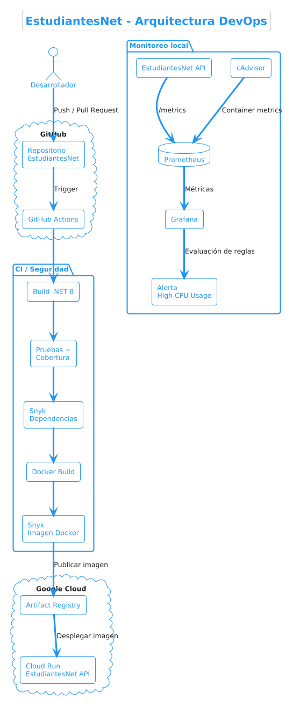


## 🔄 Pipeline CI/CD

El proyecto utiliza GitHub Actions para automatizar el ciclo de integración y despliegue de la aplicación.

Cada cambio integrado al repositorio activa un flujo que valida el código, ejecuta las pruebas, realiza análisis de seguridad, construye y analiza la imagen Docker, la publica en Google Artifact Registry y finalmente despliega la aplicación en Google Cloud Run.

### 🚦 Flujo automatizado
````
🐙 GitHub
   │
   │ Push / Pull Request
   ▼
⚙️ GitHub Actions
   │
   ├── 🔧 Configuración de .NET 8
   │
   ├── 📦 Restaurar dependencias
   │
   ├── 🏗️ Compilar solución
   │
   ├── 🧪 Ejecutar pruebas
   │
   ├── 📊 Generar cobertura
   │
   ├── 🔐 Snyk - Análisis de dependencias
   │
   ├── 🐳 Construir imagen Docker
   │
   ├── 🔎 Snyk - Análisis de imagen
   │
   ├── 📦 Publicar en Artifact Registry
   │
   └── 🚀 Desplegar en Cloud Run
````

### 🔵 Continuous Integration — CI

La etapa de integración continua permite validar automáticamente cada cambio antes de considerarlo apto para despliegue.

| Etapa           | Propósito                                        |
| --------------- | ------------------------------------------------ |
| 🔧 **Restore**  | Restaurar las dependencias del proyecto          |
| 🏗️ **Build**   | Compilar la solución .NET 8                      |
| 🧪 **Tests**    | Ejecutar las pruebas automatizadas               |
| 📊 **Coverage** | Generar y publicar el reporte de cobertura       |
| 🔐 **Snyk**     | Identificar vulnerabilidades en las dependencias |


### 🟢 Continuous Delivery — CD

Una vez superadas las validaciones, el pipeline continúa automáticamente con el proceso de entrega:

E| Etapa                    | Propósito                                        |
| ------------------------ | ------------------------------------------------ |
| 🐳 **Docker Build**      | Construir la imagen de la API                    |
| 🔎 **Snyk Image**        | Analizar vulnerabilidades presentes en la imagen |
| 📦 **Artifact Registry** | Publicar la imagen Docker en Google Cloud        |
| 🚀 **Cloud Run**         | Desplegar la nueva versión de la aplicación      |

### ☁️ Resultado

El flujo completo queda automatizado de extremo a extremo:
````
Código
  ↓
Validación
  ↓
Pruebas
  ↓
Seguridad
  ↓
Docker
  ↓
Artifact Registry
  ↓
Cloud Run
````

Esto permite reducir la intervención manual, detectar problemas antes del despliegue y mantener un proceso de entrega repetible, trazable y automatizado.

### ✅ Última ejecución

La última ejecución validada del pipeline completó correctamente todas las etapas:

* ✅ Compilación
* ✅ Pruebas y cobertura
* ✅ Snyk — dependencias
* ✅ Construcción de imagen Docker
* ✅ Snyk — imagen Docker
* ✅ Publicación en Artifact Registry
* ✅ Despliegue en Cloud Run

Resultado: succeeded en aproximadamente 3 minutos y 16 segundos.

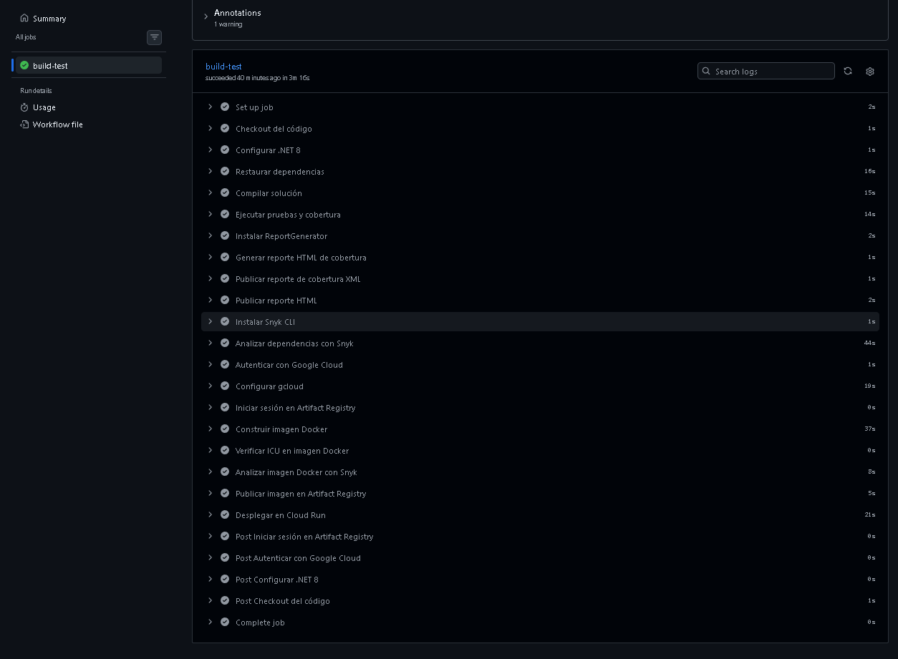


## 🔐 Seguridad

La seguridad se integra directamente dentro del pipeline CI/CD mediante **Snyk**, permitiendo identificar vulnerabilidades antes de que una nueva versión de la aplicación sea desplegada.

El análisis se realiza en **dos niveles**:

```text
📦 Dependencias del proyecto
          │
          ▼
     🔐 Snyk Open Source
          │
          ▼
   Vulnerabilidades en
   paquetes y dependencias
```
y posteriormente:

```text
🐳 Imagen Docker
       │
       ▼
   🔐 Snyk Container
       │
       ▼
Vulnerabilidades de la
imagen y componentes base
```

### 🛡️ Análisis de dependencias

Durante la etapa de integración continua, Snyk analiza las dependencias utilizadas por la solución .NET.

Esta validación permite detectar componentes con vulnerabilidades conocidas y proporciona información para evaluar acciones de actualización o corrección.

### 🐳 Análisis de la imagen Docker

Después de construir la imagen de la aplicación, el pipeline ejecuta un segundo análisis utilizando Snyk.

Esta etapa permite identificar vulnerabilidades asociadas tanto a los componentes de la aplicación como a las librerías presentes en la imagen base utilizada por Docker.

El análisis se ejecuta antes de publicar la imagen en Google Artifact Registry, incorporando un control adicional de seguridad al proceso de entrega.

### 🔄 Seguridad integrada al CI/CD

El proceso queda integrado de la siguiente manera:

```text
Código
  │
  ▼
Build + Tests
  │
  ▼
🔐 Snyk
Dependencias
  │
  ▼
Docker Build
  │
  ▼
🔐 Snyk
Imagen Docker
  │
  ▼
Artifact Registry
  │
  ▼
Cloud Run
```
De esta forma, la seguridad no se considera una actividad independiente al final del desarrollo, sino un control integrado dentro del ciclo de entrega continua.

### ✅ Evidencia

La ejecución del pipeline muestra correctamente las etapas:

* ✅ Analizar dependencias con Snyk
* ✅ Analizar imagen Docker con Snyk
* ✅ Publicar imagen en Artifact Registry
* ✅ Desplegar en Cloud Run

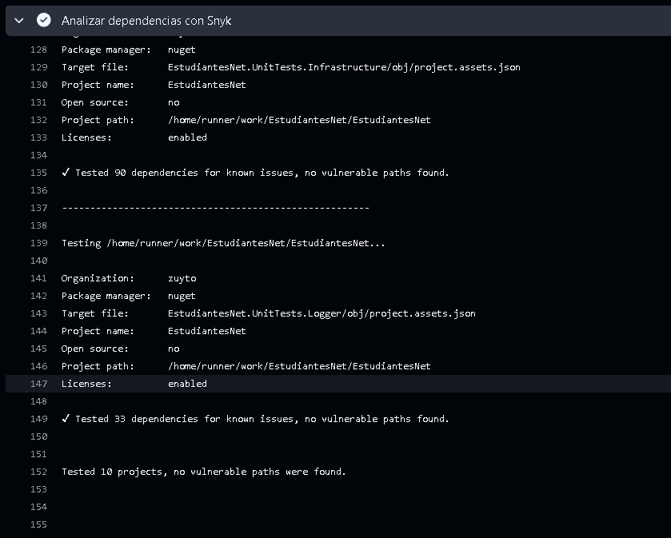

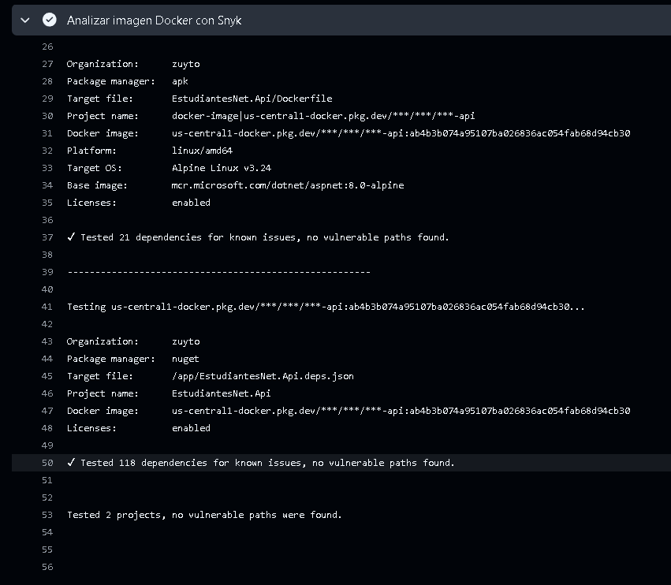


## ☁️ Despliegue en Google Cloud

La aplicación **EstudiantesNet API** se encuentra desplegada en **Google Cloud Platform (GCP)** utilizando **Google Artifact Registry** para almacenar la imagen Docker y **Google Cloud Run** como plataforma de ejecución.

### 📦 Artifact Registry

La imagen Docker generada durante el pipeline CI/CD se publica automáticamente en un repositorio de **Artifact Registry**.

```text
🐳 Docker Image
      │
      │ Push
      ▼
📦 Google Artifact Registry
      │
      │ Pull
      ▼
☁️ Google Cloud Run
```

El repositorio utilizado es:

| Configuración  | Valor            |
| -------------- | ---------------- |
| 📦 Repositorio | `estudiantesnet` |
| 🐳 Formato     | Docker           |
| 🌎 Región      | `us-central1`    |
| ☁️ Proyecto    | `estudiantesnet` |


### 🚀 Cloud Run

Google Cloud Run se utiliza para ejecutar la aplicación como un servicio administrado de contenedores.

El pipeline obtiene la imagen publicada en Artifact Registry y realiza automáticamente el despliegue de la nueva versión.

| Configuración | Valor                                |
| ------------- | ------------------------------------ |
| 🚀 Servicio   | `estudiantesnet-api`                 |
| 🌎 Región     | `us-central1`                        |
| 📦 Imagen     | Google Artifact Registry             |
| 🐳 Runtime    | Contenedor Docker                    |
| 🔄 Despliegue | Automatizado mediante GitHub Actions |


### 🔄 Flujo de despliegue

```text
🐙 GitHub
   │
   ▼
⚙️ GitHub Actions
   │
   ├── 🧪 Tests
   ├── 🔐 Snyk
   ├── 🐳 Docker Build
   │
   ▼
📦 Artifact Registry
   │
   ▼
🚀 Cloud Run
   │
   ▼
🌐 EstudiantesNet API
```

De esta manera, el proceso de despliegue no requiere copiar manualmente imágenes ni ejecutar comandos de actualización en Cloud Run. La publicación de la imagen y el despliegue de la aplicación forman parte del pipeline automatizado.

### ✅ Estado del despliegue

La última ejecución del pipeline completó correctamente la etapa:

```text
Desplegar en Cloud Run
```
El servicio `estudiantesnet-api` se encuentra desplegado en la región `us-central1`.


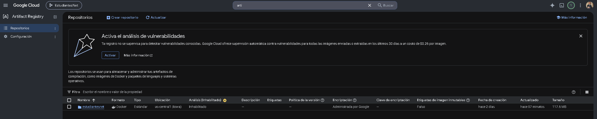


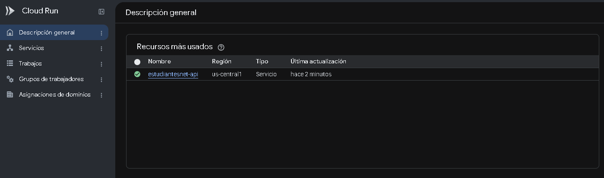


## 📊 Monitoreo

La solución incorpora un entorno de observabilidad basado en **Prometheus**, **Grafana** y **cAdvisor**, permitiendo recopilar, consultar y visualizar métricas de la aplicación y de los contenedores.

### 🔎 Arquitectura de monitoreo

```text
🌐 EstudiantesNet API
        │
        │ /metrics
        ▼
📈 Prometheus
        │
        │ PromQL
        ▼
📊 Grafana
        │
        ├── 📈 Dashboards
        └── 🚨 Alertas
```
```text
🐳 Contenedores
        │
        ▼
🖥️ cAdvisor
        │
        ▼
📈 Prometheus
```

### Prometheus

Prometheus es utilizado como sistema de recopilación y almacenamiento de métricas.

La API expone un endpoint:
```text
/metrics
```
que proporciona métricas relacionadas con el comportamiento de la aplicación.

que proporciona métricas relacionadas con el comportamiento de la aplicación.

Prometheus consulta periódicamente este endpoint y almacena las series temporales para posteriormente ser consultadas mediante PromQL.

La configuración utiliza un intervalo de scraping de:
```text
5 segundos
```

### Grafana

**Grafana** se utiliza como herramienta de visualización y análisis de las métricas recolectadas por Prometheus.

Se configuró Prometheus como fuente de datos y se construyeron visualizaciones para observar el comportamiento de la aplicación y los contenedores.

Entre las métricas utilizadas se encuentran:

| Métrica                                  | Información                           |
| ---------------------------------------- | ------------------------------------- |
| 🟢 `up`                                  | Estado de disponibilidad del servicio |
| 🌐 `http_request_duration_seconds_count` | Cantidad de solicitudes HTTP          |
| 💾 `dotnet_total_memory_bytes`           | Memoria utilizada por .NET            |
| ♻️ `dotnet_collection_count_total`       | Colecciones del Garbage Collector     |
| 🧠 `container_cpu_usage_seconds_total`   | Uso de CPU del contenedor             |
| 💾 `container_memory_working_set_bytes`  | Memoria utilizada por el contenedor   |
| 🚀 `container_start_time_seconds`        | Momento de inicio del contenedor      |


### cAdvisor

**cAdvisor** permite recopilar métricas relacionadas con los contenedores que se encuentran ejecutándose en el entorno local.

Estas métricas son enviadas a Prometheus y posteriormente utilizadas por Grafana para construir visualizaciones sobre el comportamiento de los contenedores.

Se utilizaron métricas relacionadas con:

* 🧠 Uso de CPU
* 💾 Uso de memoria
* 🚀 Tiempo de inicio de contenedores
* ♻️ Reinicios
* 📦 Información de los contenedores
* ☸️ Información de los Pods de Kubernetes

### ☸️ Monitoreo del despliegue local

Durante las pruebas locales, la API se ejecutó sobre Kubernetes en Docker Desktop.

cAdvisor permitió obtener información del contenedor correspondiente a:
```text
estudiantesnet-api
```
y Prometheus permitió consultar estas métricas desde Grafana.

### 🚨 Alertas

Se configuró una regla de alerta en Grafana:
```text
EstudiantesNet - High CPU Usage
```

Esta regla permite identificar situaciones en las que el consumo de CPU de la aplicación supera el umbral definido.

La alerta se encuentra integrada dentro del sistema de observabilidad y puede ser consultada desde:

**Grafana** → **Alerting** → **Alert rules**

Nota: el contact point de correo fue configurado, pero el entorno local de Grafana no tiene un servidor SMTP configurado. Por esta razón, la prueba de envío de correo no se ejecutó. La regla de alerta permanece configurada y puede ser evaluada por Grafana.

### 🔄 Flujo de observabilidad
```text
📦 Aplicación / Contenedores
          │
          ▼
     📈 Métricas
          │
          ▼
      Prometheus
          │
          ▼
       Grafana
       /      \
      ▼        ▼
 📊 Dashboard 🚨 Alertas
```


## 📈 Métricas monitoreadas

#### **Prometheus_up**

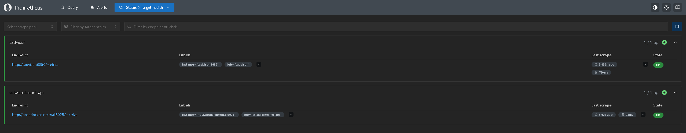

#### **Prometheus_query**

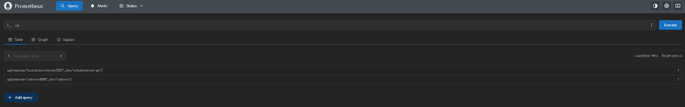

#### **Grafana_monitoring**

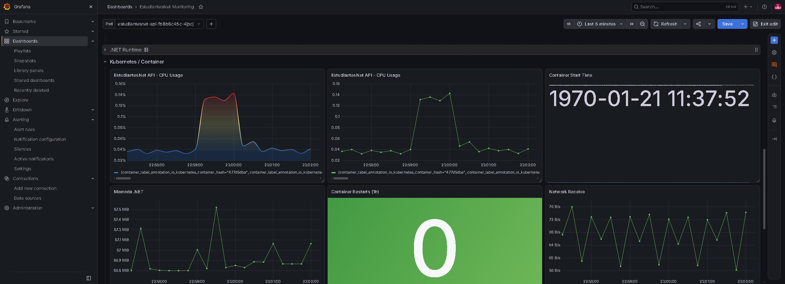

#### **RunTime_Memory**

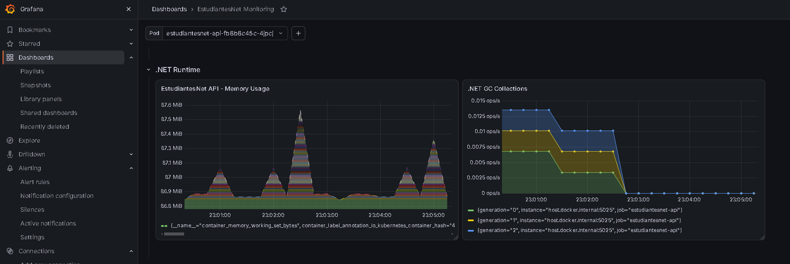

#### **Errors_Status_Duration**

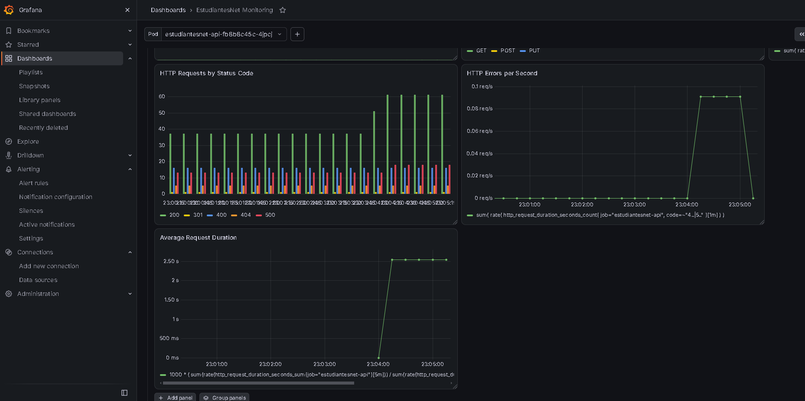


#### **cAdvisor**

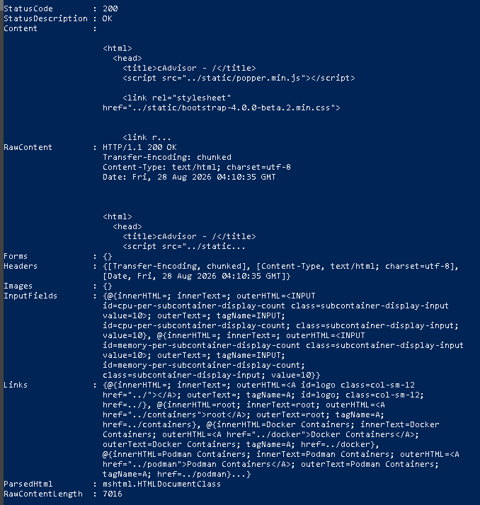


## 🚨 Alertas

El sistema de monitoreo incorpora una regla de alerta configurada en Grafana, permitiendo identificar de forma automática comportamientos que puedan afectar el rendimiento de la aplicación.

### ⚠️ Alerta configurada
EstudiantesNet - High CPU Usage

La alerta evalúa el consumo de CPU del contenedor asociado a la aplicación y permite detectar situaciones en las que el uso de recursos supera el umbral definido.

```text
🖥️ EstudiantesNet API │ ▼ 📈 Métricas de CPU │ ▼ Prometheus │ ▼ Grafana │ ▼ 🚨 High CPU Usage
```
La alerta permite detectar un consumo elevado de CPU en el contenedor asociado a la aplicación.

### 🔄 Flujo de evaluación


```text
🖥️ EstudiantesNet API
          │
          ▼
    📈 Métricas de CPU
          │
          ▼
      Prometheus
          │
          ▼
       Grafana
          │
          ▼
🚨 High CPU Usage
```

Grafana consulta periódicamente las métricas almacenadas en Prometheus y evalúa la condición definida en la regla de alerta.

Cuando la métrica supera el umbral configurado, la regla cambia de estado y permite identificar oportunamente un posible problema de rendimiento.

| Componente | Función |
|---|---|
| 📈 **Prometheus** | Recolecta y almacena las métricas |
| 📊 **Grafana** | Evalúa la condición configurada |
| 🚨 **Alert Rule** | Detecta el consumo elevado de CPU |
| 📬 **Contact Point** | Define el canal para recibir la notificación |


Grafana consulta periódicamente las métricas almacenadas en Prometheus y evalúa la condición definida en la regla de alerta.

Cuando el consumo de CPU supera el umbral configurado, la regla puede cambiar de estado y generar una notificación.

### 📬 Notificaciones

Se configuró un Contact Point para el envío de notificaciones mediante correo electrónico.

El entorno local de Grafana no tiene configurado un servidor SMTP, por lo que la prueba de envío de correo no pudo ejecutarse correctamente.

La regla de alerta permanece configurada y disponible dentro de Grafana.
```text
💡 En un entorno productivo, esta configuración puede integrarse con un proveedor SMTP u otros canales de notificación para informar automáticamente a los responsables de la operación.
```

### 🎯 Beneficio

La incorporación de alertas permite evolucionar desde un monitoreo reactivo hacia un enfoque más proactivo, facilitando la identificación temprana de problemas relacionados con el consumo de recursos.

#### **grafana_alerting**

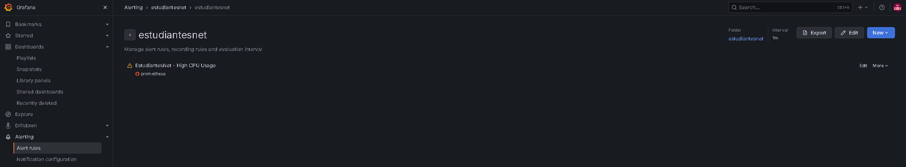
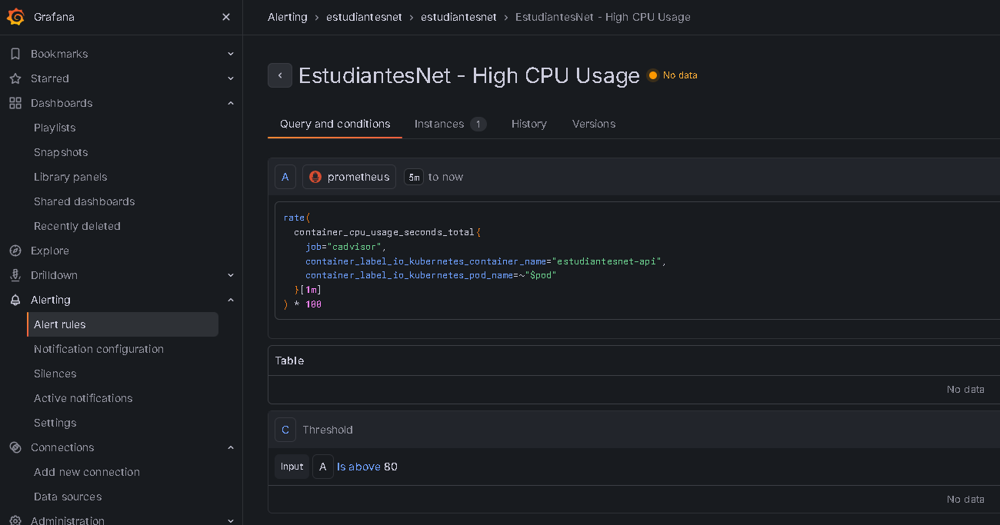


## 🐳 Ejecución local


Durante el laboratorio se utilizó un entorno local para validar la aplicación, el despliegue en contenedores y las herramientas de monitoreo.

### 🧩 Componentes utilizados

- 🟦 **.NET 8** — ejecución de la API.
- 🐳 **Docker Desktop** — ejecución de contenedores.
- ☸️ **Kubernetes** — despliegue local de la API.
- 📈 **Prometheus** — recolección de métricas.
- 📊 **Grafana** — visualización y alertas.
- 🖥️ **cAdvisor** — métricas de los contenedores.

### 🚀 Ejecución de la API

La API puede ejecutarse directamente desde **Visual Studio** utilizando el perfil de ejecución configurado para el proyecto.

Durante las pruebas locales, la API quedó disponible mediante HTTPS en:

```text
https://localhost:5025
```

El endpoint utilizado por Prometheus para obtener las métricas es:

```text
https://localhost:5025/metrics
```

La disponibilidad del endpoint fue validada obteniendo una respuesta:

```text
HTTP/1.1 200 OK
```

### 📈 Ejecución del entorno de monitoreo

Las herramientas de monitoreo se ejecutan mediante Docker Compose.

El archivo utilizado se encuentra en:

```text
monitoring/
├── docker-compose.yml
└── prometheus.yml
```

Para iniciar el entorno:

```text
cd monitoring

docker compose up -d
```

Para verificar los contenedores:
```text
docker ps
```

| Servicio                  | URL                      | Propósito                             |
| ------------------------- | ------------------------ | ------------------------------------- |
| 🚀 **EstudiantesNet API** | `https://localhost:5025` | API REST                              |
| 📈 **Prometheus**         | `http://localhost:9090`  | Consulta y almacenamiento de métricas |
| 📊 **Grafana**            | `http://localhost:3000`  | Dashboards y alertas                  |
| 🖥️ **cAdvisor**          | `http://localhost:8081`  | Métricas de contenedores              |


### 🔎 Validación de métricas

El endpoint de métricas de la API fue validado localmente mediante:
```text
Invoke-WebRequest https://localhost:5025/metrics
```
La respuesta contiene métricas de ASP.NET Core y .NET, entre ellas:
```text
http_request_duration_seconds
dotnet_collection_count_total
dotnet_total_memory_bytes
```
Estas métricas son posteriormente consultadas por Prometheus y utilizadas por Grafana para las visualizaciones del dashboard.

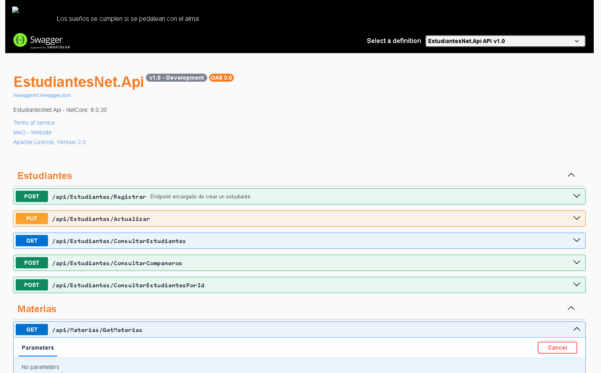
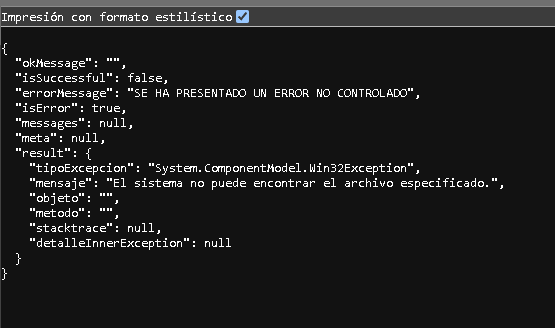
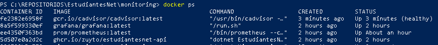


## ☸️ Kubernetes

Como parte de la validación de la solución, **EstudiantesNet API** fue desplegada localmente utilizando **Kubernetes sobre Docker Desktop**.

Este entorno permitió validar el funcionamiento de la aplicación dentro de un contenedor administrado por Kubernetes, así como la exposición del servicio para realizar pruebas.

### 🏗️ Arquitectura 

```text
☸️ Kubernetes - Docker Desktop
          │
          ▼
    📦 Deployment
          │
          ▼
    🟢 Pod
          │
          ▼
🚀 estudiantesnet-api
          │
          ▼
    🌐 Kubernetes Service
          │
          ▼
    🔗 NodePort
```

### 📦 Deployment

La aplicación se ejecuta mediante un recurso Deployment, encargado de administrar los Pods de la API.

El Deployment utilizado corresponde a:
```
estudiantesnet-api
```

Durante la validación se comprobó que el Pod de la aplicación se encontraba en estado:
```
Running
```


### 🟢 Pod

El Pod generado por Kubernetes corresponde a la instancia de ejecución de la API.

Ejemplo del Pod utilizado durante las pruebas:
```
estudiantesnet-api-fb8b8c45c-4jpcj
```
El estado del Pod fue validado mediante:
```
kubectl get pods
```
Resultado esperado:
```
NAME                                READY   STATUS    RESTARTS
estudiantesnet-api-fb8b8c45c-4jpcj  1/1     Running   ...
```

### 🌐 Service

Para permitir el acceso a la aplicación se configuró un Service de tipo NodePort.

El servicio utilizado es:
```
estudiantesnet-api
```
Durante las pruebas se obtuvo una exposición mediante:
```
8080:31017/TCP
```
Esto permitió acceder a la aplicación mediante el puerto publicado por Kubernetes.

La configuración fue validada mediante:
```
kubectl get services
```

### 🔎 Validación del despliegue

El estado de los recursos se comprobó utilizando los comandos de Kubernetes:
```
kubectl get nodes
kubectl get pods
kubectl get services
```
El nodo local de Docker Desktop se encontró disponible y el Pod de estudiantesnet-api se ejecutó correctamente.

### 📊 Integración con monitoreo

El despliegue de Kubernetes también permitió complementar el monitoreo mediante cAdvisor.

cAdvisor identificó el contenedor correspondiente a la aplicación y expuso métricas relacionadas con:

* 🧠 CPU
* 💾 Memoria
* 🚀 Tiempo de inicio
* ♻️ Reinicios
* 📦 Información del contenedor
* ☸️ Información del Pod

Estas métricas fueron posteriormente recolectadas por Prometheus y visualizadas mediante Grafana.

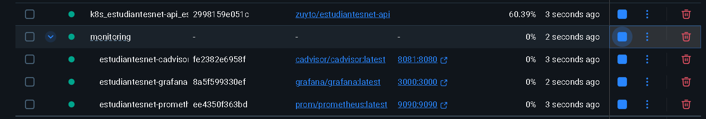
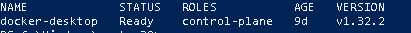
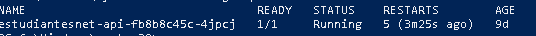
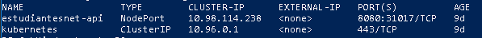


## 🧪 Pruebas y cobertura

La calidad de la aplicación se valida automáticamente dentro del pipeline de **GitHub Actions**, ejecutando las pruebas automatizadas antes de construir y desplegar la imagen Docker.

### 🧪 Pruebas automatizadas

La solución cuenta con diferentes proyectos de pruebas que validan las principales capas de la aplicación:

```text
EstudiantesNet
│
├── 🧩 EstudiantesNet.Api
│   └── 🧪 Tests
│
├── ⚙️ EstudiantesNet.Application
│   └── 🧪 Tests
│
├── 🏛️ EstudiantesNet.Domain
│   └── 🧪 Tests
│
├── 🔌 EstudiantesNet.Infrastructure
│   └── 🧪 Tests
│
└── 📝 EstudiantesNet.Logger
    └── 🧪 Tests
```

Las pruebas cubren diferentes componentes de la solución, permitiendo detectar errores durante el proceso de integración continua.

### 🔄 Ejecución dentro del pipeline

Las pruebas se ejecutan automáticamente mediante GitHub Actions:

```
📦 Restaurar dependencias
          ↓
🏗️ Compilar solución
          ↓
🧪 Ejecutar pruebas
          ↓
📊 Generar cobertura
          ↓
🔐 Análisis de seguridad
          ↓
🐳 Construcción de imagen
          ↓
🚀 Despliegue
```

De esta forma, una versión que no supere las validaciones iniciales no debería avanzar hacia las siguientes etapas del proceso de entrega.

### 📊 Cobertura de código

Además de ejecutar las pruebas, el pipeline genera información de cobertura utilizando herramientas de .NET y ReportGenerator.

El proceso contempla:

* 🧪 Ejecución de pruebas automatizadas.
* 📊 Generación del reporte de cobertura.
* 📄 Generación del reporte en formato HTML.
* 📋 Publicación del reporte como artefacto de GitHub Actions.
* ✅ Resultado de la ejecución

La ejecución más reciente del pipeline finalizó correctamente:
```
✅ Ejecutar pruebas y cobertura
✅ Instalar ReportGenerator
✅ Generar reporte HTML de cobertura
✅ Publicar reporte de cobertura XML
✅ Publicar reporte HTML
```

El pipeline completó exitosamente todas las etapas posteriores de seguridad, construcción y despliegue.

🎯 Beneficios

La automatización de las pruebas permite:

* Detectar errores antes del despliegue.
* Validar automáticamente los cambios realizados.
* Mantener trazabilidad de las ejecuciones.
* Generar métricas de cobertura.
* Reducir la posibilidad de introducir regresiones.
* Integrar la calidad dentro del ciclo CI/CD.

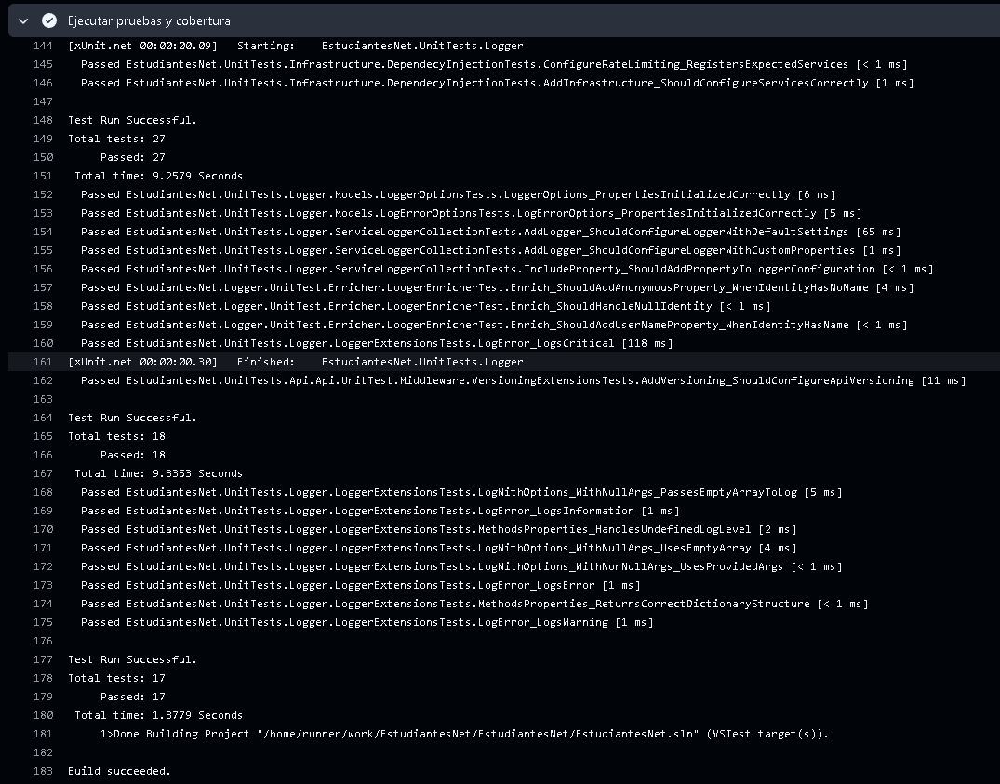
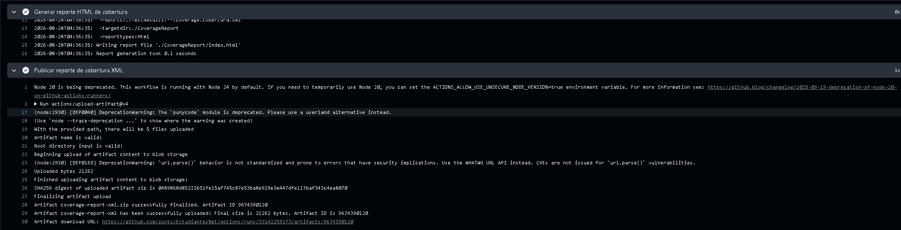
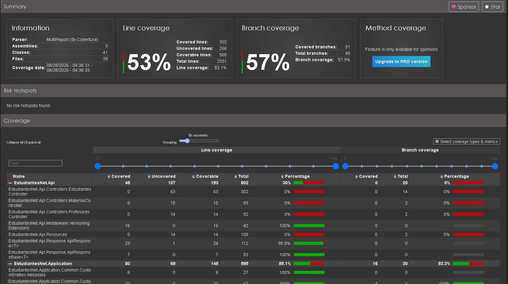


## 📁 Estructura del proyecto

El repositorio se encuentra organizado separando el código fuente de la aplicación, las pruebas automatizadas, la configuración de CI/CD, los archivos de despliegue y los componentes de monitoreo.

### 🗂️ Organización general

```text
EstudiantesNet/
│
├── 📁 EstudiantesNet.Api/
│   ├── Controllers/
│   ├── Middleware/
│   ├── DependencyInjection/
│   ├── Dockerfile
│   └── Program.cs
│
├── 📁 EstudiantesNet.Application/
│
├── 📁 EstudiantesNet.Domain/
│
├── 📁 EstudiantesNet.Infrastructure/
│
├── 📁 EstudiantesNet.Logger/
│
├── 📁 Tests/
│   ├── 🧪 EstudiantesNet.Api.UnitTests/
│   ├── 🧪 EstudiantesNet.Application.UnitTests/
│   ├── 🧪 EstudiantesNet.Domain.UnitTests/
│   ├── 🧪 EstudiantesNet.Infrastructure.UnitTests/
│   └── 🧪 EstudiantesNet.Logger.UnitTests/
│
├── 📁 .github/
│   └── 📁 workflows/
│       └── ⚙️ ci.yml
│
├── 📁 Kubernetes/
│   ├── deployment.yaml
│   └── service.yaml
│
├── 📁 monitoring/
│   ├── docker-compose.yml
│   └── prometheus.yml
│
├── 📄 EstudiantesNet.sln
└── 📄 README.md
```

### ⚙️ CI/CD

La configuración de integración y despliegue continuo se encuentra en:
```
.github/workflows/
└── ci.yml
```
Este workflow contiene las etapas automatizadas de:

* 🏗️ Compilación.
* 🧪 Pruebas.
* 📊 Cobertura.
* 🔐 Análisis con Snyk.
* 🐳 Construcción de la imagen Docker.
* 📦 Publicación en Artifact Registry.
* 🚀 Despliegue en Cloud Run.
* ☸️ Kubernetes

Los archivos utilizados para la validación del despliegue local se encuentran en:
```
Kubernetes/
├── deployment.yaml
└── service.yaml
```
Estos archivos permiten definir los recursos necesarios para ejecutar la API dentro de Kubernetes.

### 📊 Monitoreo

La configuración del entorno de monitoreo se encuentra en:
```
monitoring/
├── docker-compose.yml
└── prometheus.yml
```
Estos archivos permiten levantar:

* 📈 Prometheus.
* 📊 Grafana.
* 🖥️ cAdvisor.

### 🐳 Contenerización / Dockerfile

El proyecto incluye un Dockerfile utilizado por GitHub Actions para construir la imagen de la API.

La imagen resultante es publicada automáticamente en Google Artifact Registry y posteriormente utilizada para realizar el despliegue en Google Cloud Run.

La aplicación utiliza un `Dockerfile` ubicado en:
```text
EstudiantesNet.Api/Dockerfile
```
Este archivo define las instrucciones necesarias para construir la imagen Docker de la API.

Durante el pipeline CI/CD, GitHub Actions utiliza este Dockerfile para construir la imagen, analizarla mediante Snyk y posteriormente publicarla en **Google Artifact Registry**.

La imagen publicada es utilizada posteriormente para realizar el despliegue de la aplicación en Google Cloud Run.

### 🔗 Repositorio

El código fuente y todas las configuraciones del proyecto se encuentran disponibles en:

👉 [Repositorio EstudiantesNet en GitHub](https://github.com/zuyto/EstudiantesNet)


## 🎓 Reflexión DevOps / Reflexión sobre eficiencia operativa

La implementación del pipeline CI/CD permitió integrar en un mismo flujo las actividades de desarrollo, pruebas, seguridad, construcción y despliegue de la aplicación.

Antes de automatizar este proceso, cada una de estas actividades podría requerir intervención manual. Con GitHub Actions se estableció un flujo repetible que permite ejecutar las validaciones y el despliegue de manera automática.

### ⚡ Impacto de la automatización

La solución implementada aporta mejoras en diferentes aspectos:

- 🚀 **Velocidad:** reduce el tiempo necesario para llevar una nueva versión desde el código hasta el entorno de ejecución.
- 🔄 **Repetibilidad:** cada ejecución sigue las mismas etapas y condiciones.
- 🧪 **Calidad:** las pruebas automatizadas permiten detectar errores antes del despliegue.
- 🔐 **Seguridad:** Snyk incorpora controles de seguridad sobre dependencias e imágenes Docker.
- 📦 **Trazabilidad:** GitHub Actions permite consultar el resultado y el historial de cada ejecución.
- ☁️ **Despliegue automatizado:** Artifact Registry y Cloud Run permiten publicar y ejecutar las nuevas versiones sin intervención manual.
- 📊 **Observabilidad:** Prometheus y Grafana permiten obtener información sobre el comportamiento de la aplicación y los recursos utilizados.

### 🔐 DevSecOps

La seguridad fue incorporada como parte del ciclo de desarrollo y no como una actividad posterior al despliegue.

El pipeline ejecuta análisis de Snyk sobre:

```text
📦 Dependencias
      │
      ▼
🔐 Snyk
      │
      ▼
🐳 Imagen Docker
      │
      ▼
🔐 Snyk
      │
      ▼
📦 Artifact Registry
      │
      ▼
☁️ Cloud Run
```

Esto permite detectar posibles vulnerabilidades antes de que la imagen sea utilizada en el entorno de ejecución.

### 📊 Observabilidad y operación

La incorporación de Prometheus, Grafana y cAdvisor permite complementar el proceso de entrega con información sobre el comportamiento de la aplicación.

Las métricas permiten observar aspectos como:

* 🧠 CPU.
* 💾 Memoria.
* 🌐 Solicitudes HTTP.
* ♻️ Reinicios de contenedores.
* 🚀 Tiempo de inicio.
* 📦 Estado de los contenedores.

Además, la configuración de alertas permite establecer mecanismos para identificar condiciones que puedan requerir atención.

### 🎯 Conclusión

El laboratorio permitió comprobar que DevOps no consiste únicamente en automatizar un despliegue, sino en integrar diferentes prácticas a lo largo del ciclo de vida del software.

La combinación de GitHub Actions, Docker, Snyk, Artifact Registry, Cloud Run, Prometheus y Grafana permite construir un proceso más automatizado, trazable y orientado a la mejora continua.

Como evolución futura, el entorno podría incorporar herramientas adicionales de análisis de código, gestión centralizada de logs, mayores controles de seguridad y estrategias de despliegue como Blue/Green o Canary, dependiendo de los requerimientos del sistema.


## 👥 Equipo de trabajo

Este proyecto fue desarrollado como un **laboratorio técnico de carácter académico y colaborativo**, como parte de la asignatura **Fundamentos de DevOps**.

### 🎓 Información académica

- **Asignatura:** Fundamentos de DevOps
- **Actividad:** Laboratorio técnico – Implementación de CI/CD, Seguridad y Monitoreo
- **Tipo de trabajo:** Colaborativo
- **Programa:** Maestría en Arquitectura de Software
- **Institución:** Universidad de La Sabana
- **Docente:** Maria Fernanda Ochoa

### 👨‍💻 Integrantes

- **Mauro Martínez** 
- **Oscar Mauricio Dominguez Giraldo**
- **Andres Felipe Lara Nieto**

---

### 📌 Nota académica

Este repositorio corresponde a un **laboratorio didáctico**, desarrollado con fines académicos para aplicar conceptos y herramientas del ecosistema DevOps.

La implementación integra prácticas de:

- 🔄 Integración y despliegue continuo (CI/CD)
- 🐳 Contenerización
- ☸️ Kubernetes
- 🔐 Seguridad y análisis de vulnerabilidades
- ☁️ Computación en la nube
- 📊 Monitoreo y observabilidad
- 🚨 Gestión de alertas
- 🧪 Pruebas automatizadas

El proyecto busca demostrar de manera práctica la integración de estas tecnologías dentro del ciclo de vida del desarrollo de software.

---

**© 2026 – Laboratorio académico de Fundamentos de DevOps**
